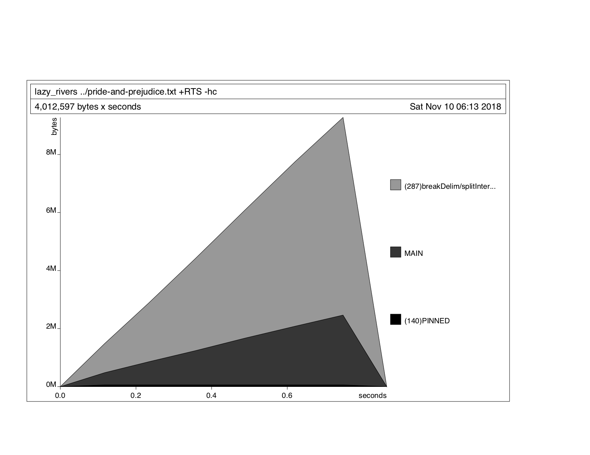

## Contnets

### Style 26: Spreadsheets in JavaScript

To run:
```
node spreadsheet.js [Input file]
```

### Style 27: Lazy Rivers in Haskell and JavaScript
I was not sure if it will be okay to implement this exercise in Haskell, since dataflow and lazy evaluaation are naturl and can be done automatically.
I however extracted memory usage profiling chart from my Haskell progrm to show that functions such as file access do not need large data chunk of data. 
You can see that the memory is indeed growing linearly as statistics about more words is collected.

To run 
```
ghc --make lazy_rivers.hs
./lazy_rivers [input_file]
```


   
   
or try JavaSCript version instead:
```
node lazy_rivers.js [input_file]
```   